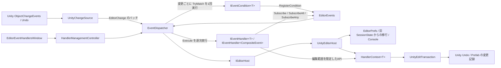
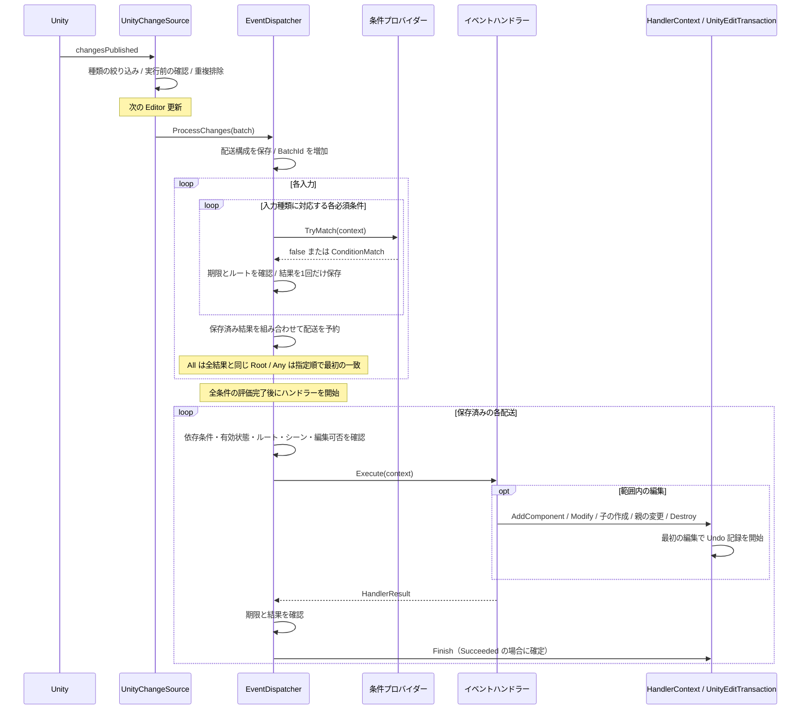
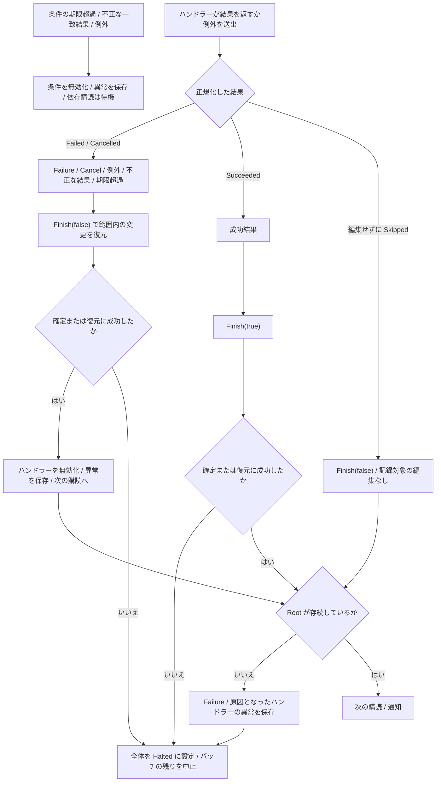

# 実装の構成

このライブラリはUnity Editor用です。条件プロバイダーとイベントハンドラーの購読を公開APIで登録し、イベントディスパッチャーが型に応じて実行します。イベントディスパッチャーの管理処理とUnity接続を分離しています。別エンジン向けの公開イベントバスではありません。

| 実装 | 責務・境界 |
|---|---|
| EditorEvents / Contracts | 公開登録API、条件・ハンドラー・通知・状態トークン |
| EventDispatcher | 登録上限、入力ごとの条件の判定結果の共有、単一/AND/ORの配送、逐次実行、全条件の評価後のイベントハンドラー実行、失敗無効化、異常時の全体停止 |
| IEditorHost / UnityEditorHost | 内部の実行環境の境界。メインスレッド、Editor状態、Rootの適格性・存続・シーン、コンテキストの生成、設定保存、ログ |
| IEditorChangeSource / UnityChangeSource | 内部の入力の境界。Unity通知の変換、重複排除、更新時のバッチ化、Undo/Redo除外、必要な種類だけの購読 |
| EditorRuntime | InitializeOnLoadでUnity側の実行環境と入力元を組み立てる内部の入口 |
| EditorObjectId / EditorSceneId | 旧Unity IDと新IDの差を内部値を公開しない型で吸収 |
| HandlerContext / UnityEditTransaction | 期限と編集API。変更が必要になってからUndo記録を生成し、確定・復元する |
| HandlerManagementController / EditorEventHandlersWindow | 内部・派生クラス向けの管理操作と非公開のUIアダプター。条件ソースの閲覧 |
| Avatar Placement | Descriptor・Prefab・胸シェイプ名の意味判定条件プロバイダー。イベントディスパッチャーにはこれらの知識を含めない |

実行環境や入力元を差し替える公開APIはありません。条件プロバイダーとイベントハンドラーは設定、全体停止、任意発火の入口を持ちません。公開通知はUnity GameObjectを含み、Unity参照の直接変更を隔離する境界ではありません。

## 通常の処理

バッチの配送構成を保存するため、新規登録は次バッチから対象です。解除・無効化は後続処理に反映します。依存する条件プロバイダーが解除・置換された場合も古い結果は使いません。入力変更1件につき各条件プロバイダーを最大1回評価し、単一購読・複合購読で結果を共有します。結果を別入力や別バッチへ持ち越して結合しません。対象状態や通知に含まれるUnity参照は固定された全階層コピーではありません。

AND/OR購読は必要な通知型を登録し、イベントディスパッチャーが条件プロバイダーの評価結果を組み合わせます。両モードともすべての必要な条件プロバイダーが存在し、有効であることが前提です。入力種類に興味のない条件プロバイダーはその入力で不一致として扱います。ANDは全条件一致かつ同一Rootの場合だけ配送します。ORは型一覧の先頭から最初に一致した通知とRootだけを選び、`CompositeEvent.TryGet<T>`でその通知を取得できます。ORの短絡は保存済み結果の選択だけに適用し、条件プロバイダーの評価を省略しません。

単一・AND・ORの一致結果を保存し、ハンドラーを逐次実行します。ハンドラー間の実行順は公開契約に含めません。ORの型選択順は通知結果の選択だけを定義します。複合購読はイベントハンドラーとして1登録を使用し、依存条件プロバイダーはそれぞれ1登録を使用します。

## 異常・停止

条件・ハンドラーの期限は各1〜100 ms、既定100 msで独立しています。登録は合計100件です。強制終了はなく、無限ループから制御が戻らなければ管理側も処理できません。復元はContext経由のUndo対応編集に限定されます。全体停止は確定/復元異常またはRoot喪失で即時適用し、ドメインリロードまたはEditor再起動で解除されます。

条件・購読の異常無効化は全体停止と別の寿命です。手動の有効/無効・期限とともにプロジェクトごとのEditorPrefsへ保存し、Editor再起動後の同じ登録にも適用します。UIの有効化は保存済み異常理由も削除し、手動無効化はその指定を優先します。旧SessionStateからの移行は、永続異常記録がまだない場合だけ行います。

Undo/Redoは保留通知を破棄して次の更新まで除外します。SceneOpened/SceneLoadedの購読や既存シーンの一括走査、入力操作の常時監視はありません。通知キューは更新後に内容をクリアしますが、コレクションの確保容量は再利用し、件数のハード上限はありません。

入力ごとの条件結果と必要条件の一時コレクションはバッチ内で再利用し、各入力で内容をクリアします。静的な履歴キャッシュとして保持しません。配送する一致結果はイベントハンドラー実行まで保持し、バッチ終了後に解放します。

[APIリファレンス](../Packages/io.github.merciagrimauge.editor-event-handlers/Documentation~/API_REFERENCE.md) / [実行契約](../Packages/io.github.merciagrimauge.editor-event-handlers/Documentation~/CONTRACTS.md)
